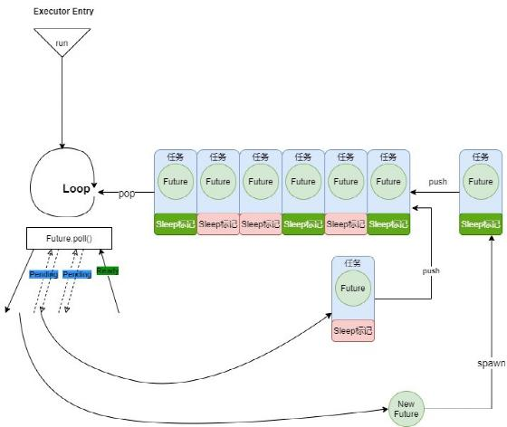

## 异步协程管理

当我们不考虑切换到用户态的情形时，zCore 可以被认为是一个简单的内核态 async 程序；在 no_std 的情况下，Rust 官方只提供了特定的语法支持和 Future Trait，不提供调度器。所以需要自行为 zCore 在单核情况下的调度实现了调度器 naïve-executor。

### **异步调度器**



图: naive-executor 执行简图

naive­-executor 采用较为简单的实现逻辑，其中维护了一个任务队列。任务队列中的每一项持有一个 Future，以及一个 sleep 标记。在执行过程中，naive­-executor 将会不断从任务队列中取出队头，检查 sleep 标记，如果该任务不在休眠状态，则调用对应 Future 的 poll 接口，将执行权交给这一 Future 内部封装的逻辑进行执行。poll 的结果将会显示该 Future 执行完毕或陷入阻塞状态，对于一次执行后陷入阻塞状态的任务，打上 sleep 标记之后重新放回队尾，等待下次调度。

naive­-executor 与传递给 poll 的上下文引用 context 是唯一有权修改 sleep 标记的两个代码区域，对于一个打算返回阻塞的 Future，实现该 Future 的开发者将必须自行考虑如何保存上下文引用 context，何时调用 context 的 wake 接口来取消当前任务的 sleep 标记。在 poll 函数返回前，Future 的实现者必须将 context 中的 waker 对象注册到某个事件的回调函数中，使得当目标事件发生时，能够通过 waker 唤醒当前任务。waker 的 wake 接口由 executor 的实现者给出。在 naive­-executor 中，我们简单将其实现为取消对应任务的 sleep 标记。

在 zCore 运行时，将会在 HAL 层相关的硬件初始化结束之后，封装第一个用户线程的顶层 Future，提交给 naive­-executor，然后立即将执行权移交给 naive-executor。naive­-executor 进行协作式调度的过程，可以看作是 zCore 内核的 IDLE线程，这也是目前 zCore 使用的唯一一个内核态线程。从 executor 的角度来看， zCore 内核为 用户程序提供服务的过程，实际上是 naive­-executor 不断维护任务队列，进行协作式调度的过程。初始状态任务队列中只有一个任务，即第一个用户程序 Userboot 的首个线程。

### **层次化 Future 对象**

#### 顶层 Future 

操作系统中，线程通常代表着一个最小可调度任务，一个线程的具体内容是一个可以被切换的执行上下文。在 zCore 的设计中，用户线程代表一个在用户态执行的任务所需要的上下文、通过系统调用请求服务的途径、出现异常时控制权移交给内核的正确入口。以上的线程实现逻辑，被我们统一封装到顶层 Future 中。

代码块一是 zCore 中现在顶层 Future 内部的主要执行逻辑。其中，由 HAL 层提供的 context_run 接口，是根据不同的硬件架构对内核态/用户态之间的上下文切换的具体实现，对上表现为一个函数的形式。当内核打算将执行权移交给用户态时，通过调用该函数切换上下文，并在内核栈中保留内核的执行上下文；当用户态发生中断、异常、主动进行系统调用时，进入内核态，从内核的执行角度来看，是 context_run 函数返回。context_run 函数并不涉及 async/await 关键字，但是可以看作是一种仅在顶层Future内部调用的、由于进入用户态而阻塞的特殊阻塞函数。调用该函数会将执行权交给用户态代码。
```rust
 loop{ 
   let mut cx = thread.wait_for_run().await;
   kernel_hal::context_run(&mut cx);
   let mut exit = false;
   match cx.trap_num {
      0x100 => exit = handle_syscall(&thread, &mut cx.general).await,
      0x20..=0x3f => { kernel_hal::irq_handle(cx.trap_num as u8 - 0x20);
      }
   }
   if exit {
        break;
   }
 }
```
代码: 顶层 Future 内部实现

上下文切换函数返回之后，CPU的状态为内核态，可以看作是运行到了内核中一个 Future 的中间部分，因此我们可以通过实现带 async 关键字的处理例程，来处理可能需要阻塞的系统调用，或者实现分时调度。例如代码块中handle_syscall 接口，是 zCore 中处理系统调用的入口点，在其中进行了系统调用的分发、处理、返回。某些系统调用在处理的过程中需要等待至特定时间或系统中某一类资源可用，在进入内核态之后需要暂时阻塞当前线程；在设计时，我们将该处理例程标记为 async 函数，其中存在.await 的位置可能将会发生阻塞，然后 naive­-executor 会将执行权交给其他顶层 Future，即其他线程，从而实现并发。

从 naive­-executor 的角度来看，每一个用户线程都是其任务队列中的一个任务，即一个被进一步封装的顶层 Future。从内核态到用户态的来回切换可以很自然地发生在这一顶层 Future 内部，而该切换过程对 naive­-executor 是透明的。即对于 naive­-executor 而言，一个顶层 Future 可能用于封装用户线程，也可能用于封装内核线程。如果将 context_run 函数内部允许传入的上下文参数代表一个内核态执行的线程，那么内核线程可以与用户线程在顶层 Future 的设计上完全统一起来。（目前暂时没有进行实现内核线程）。

#### 中层Future

在顶层 Future 中，当内核处理某些系统调用时，会面临系统调用的实时性需求以及系统调用过程中与其他进程间的交互。在未使用 Async 语法的传统内核设计中，常见的做法可能要求添加更多回调函数或采用轮询的做法。在 zCore 中，借助 Rust 提供的 async 语法支持，我们需要有别于传统做法的实现方法，也由此获得更高的效率。

在 zCore 中，由于使用了 async 语法，对于这类需求我们可以有更方便的解决办法。Rust 官方支持的 select 宏可以很好地帮助我们实现这一操作。对于 zCore 而言，带有时限要求的阻塞型系统调用，本质上可以认为是带有时限要求的中层 Future 实现需求，更进一步，我们可以同时将两个 Future 绑定在一起。两个 Future 中，一个负责等待 deadline 到来，然后返回结果；另一个则可以专注于阻塞型系统调用的本身逻辑，不需管 deadline。select 宏可以帮我们将两个 Future 进行组合，形成一个新的 Future，当其中一个 Futre 返回时，其结果作为合并 Future 的返回结果返回。

##### 支持系统调用超时

zCore本身是一个对实时性支持较为完善的内核，部分zCore系统调用支持传入deadline参数，由用户程序规定该系统调用的完成时限，以此促进用户态程序之间、用户程序与内核之间的强实时性交互。对于传入deadline参数来规定某一系统调用完成时限的需求。在不使用async语法的内核中，一种可能的做法是在系统调用例程中直接与线程调度器交互，并在全局时钟管理队列中设置对应时钟，同时还需要在deadline到来之前多次对要操作的内核对象进行轮询，比如对于当前线程等待的资源进行多次轮询。如果希望尽可能减少轮询次数，那么需要添加更多的回调函数，同时将使线程调度器、回调函数队列、时钟队列等不同组件的耦合性进一步增强；对实际的代码维护来说，并不利于低耦合设计和出错时的调试。


```rust
| /// Run async future andchange state while blocking.
pub async fn blocking_run<F, T, FT>( 
    &self, future: F, 
    state: ThreadState, 
    deadline: Duration, ) -> ZxResult<T>
where
  F: Future<Output = FT> + Unpin,
  FT: IntoResult<T>, |
{ let ret = select_biased! 
    {   ret = 
          future.fuse() => ret.into_result(), 
           _ = sleep_until(deadline).fuse() => Err(ZxError::TIMED_OUT),
    }; 
  ret
} 
```
代码：中层Future支持强实时性系统调用

在上述代码片段中展示了在zCore中用于支持系统调用的主要接口。其中future是封装了阻塞型系统调用代码的Future对象，sleep_until接口可以用于产生一个底层Future，该Future将阻塞，直到deadline时间到来时返回。在async语法和select宏的支持下，我们使用很自然而高效的语法完成了这个需求，避免了大量的回调函数的使用和复杂的代码逻辑。

##### 支持系统调用取消

zCore对于系统调用的可取消特性这一需求，主要源自于内核对象的基本设计概念，当一个阻塞型系统调用带时限要求地对某一个内核对象进行等待，希望在特定时间内得到该内核对象的某个特定信号时；这一内核对象的所有者可能并不是当前用户进程，因此该内核对象可能在等待时间内由于所在进程退出而被销毁，这时需要等待者有多元化的返回结果。至少包含等待超时、成功等待、操作被取消这三种返回结果。这三种结果的返回互不影响且任意一个结果产生将直接终止其余两个等待过程。本质上，阻塞型系统调用可取消的特性，要求一个异步的协程执行过程可以被打断。

对于这样的需求，select同样展现了非常好的契合度，我们需要同时等待三类结果，在zCore中可以认为是同时等待三个Future，select可以自然地将三个Future绑定后放入naive­executor中，并以最先返回的Future对象的结果来作为系统调用返回结果。在这里，我们借助社区已有的Future生态中的oneshot channel来实现cancel token。oneshot channel帮助我们生成一对sender与receiver，并支持对receiver进行阻塞式监听，直到sender发送消息。我们为每一个内核对象维护一个sender队列，对每一个因等待内核对象而阻塞的系统调用，在select中多加入一个协程，监控对应的receiver。当取消事件发生时，拥有内核对象的线程将调用sender的发送接口，正监控对应receiver的协程将不再阻塞，阻塞型系统调用也将退出并返回对应结果。

在zCore中，系统调用的可取消通常与实时性同时出现，在上一小节中我们展示了对系统调用实时性的具体实现，对比两个代码块3.3与3.2，不难发现使用async语法结合select宏对于这种复杂系统调用的功能添加来说，并没有导致系统的耦合度增强，这对于开发的便利和后续代码维护都将有很好的促进。

```rust
|/// Run a cancelable async future and change state while blocking.
pub async fn cancelable_blocking_run<F, T, FT>(
    &self, future: F, 
    state: ThreadState, 
    deadline: Duration,cancel_token: Receiver<()>,
    ) -> ZxResult<T>
  where
    F: Future<Output = FT> + Unpin,
    FT: IntoResult<T>,
{ let ret = select_biased! { 
     ret = future.fuse() => ret.into_result(), 
     _ = sleep_until(deadline).fuse() => Err(ZxError::TIMED_OUT),
     _ = cancel_token.fuse() => Err(ZxError::CANCELED),
     }; 
   ret
}
```

代码：中层Future支持可取消系统调用

#### 底层Future

顶层 Future 与中层 Future 的设计与实现，仍旧停留在对更低层的 Future 对象的选择与组装上。但在裸机内核态环境下，我们无法利用社区中已有的 Future 基础设施，仅通过组装来设计一个内核。在使用 async 语法对 zCore 进行一体化设计的过程中，对底层 Future 的设计是一个重要且不可避免的部分。底层 Future 的可靠性与稳定性直接影响所有直接或间接依赖该 Future 对象的所有上层 Future。因此底层 Future 的开发成本和试错成本较高，在开发过程中占据了大量的时间进行排错。zCore底层 Future 的实现都是通过手动实现 Future Trait，这也是 zCore 中对各个 poll 接口的具体实现过程。